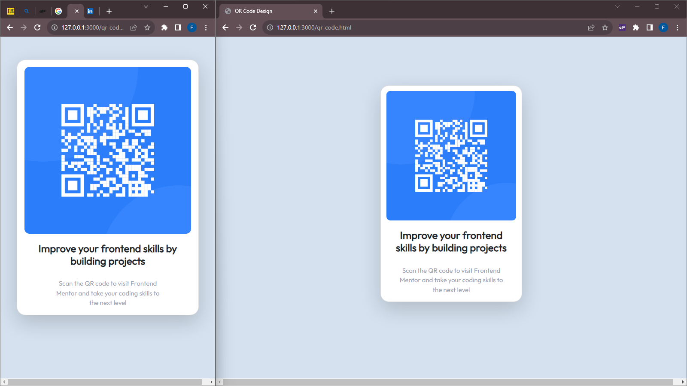

# Frontend Mentor - QR code component solution

This is a solution to the [QR code component challenge on Frontend Mentor](https://www.frontendmentor.io/challenges/qr-code-component-iux_sIO_H). Frontend Mentor challenges help you improve your coding skills by building realistic projects. 

## Table of contents

- [Overview](#overview)
  - [Screenshot](#screenshot)
  - [Links](#links)
- [My process](#my-process)
  - [Built with](#built-with)
  - [What I learned](#what-i-learned)
  - [Continued development](#continued-development)
  - [Useful resources](#useful-resources)
- [Author](#author)
- [Acknowledgments](#acknowledgments)

**Note: Delete this note and update the table of contents based on what sections you keep.**

## Overview
I designed a responsive qr-code code website using HTML/CSS and a tiny amount of bootstrap.

### Screenshot



### Links

- Solution URL: [GittHub repo for qr design](https://github.com/ShegzBit/Frontend-Mentors/tree/main/qr_code)
- Live Site URL: [Add live site URL here](https://your-live-site-url.com)

## My process
I created a card then added head and foots body and foots div containing
the image, heading, and the paragragh respectively

I intended to use card-header, car-body and card-footer of bootstrap class but it gave undesired outcome due to preset background color and other properties.
So I only sticked with the bootstrap card because it adds a tiny touch of responsiveness and used media query to finetune it

I also intended to make it responsive by boostrap grid i.e row class
but it turned out not so nice due to the fact that i had only one object being placed I.e only a column in a row making it seem awkward or maybe it's me who couldn't implement it right. I'll learn more about it and then try to apply it in future designs

### Built with

- Semantic HTML5 markup
- CSS custom properties
- Boostrap cards
- Bootstrap shadow
- Desktop-first workflow

### What I learned

I practice the use of media query to complete make website responsive,
and coupling it with Bootstrap responsive nature and use of % values for sizes of images and divs which reduced in total the work I had to do to make
the website reponsive
```css
@media screen and (max-width: 600px) {
    div.card {
        width: 80%;
    }

    div.card-foot {
        text-align: center;
        margin: 0 19%;
    }
}
```

### Continued development

I look forward to learning more about bootstrap cards and grids and using them in future challenges

### Useful resources

- [Example resource 1](https://getbootstrap.com/docs/4.1/utilities/shadows/) - This helped me for adding shadow to my box. I really liked this pattern and will use it going forward.

## Author

- Website - [Add your name here](shegzbit.github.io)
- Frontend Mentor - [@ShegzBit](https://www.frontendmentor.io/profile/ShegzBit)
- Twitter - [@feranmiawotubo1](https://www.twitter.com/yourusername/feranmiawotubo1)